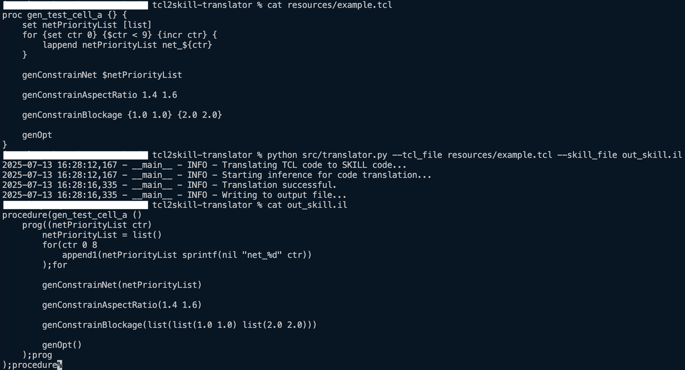

# LLM-Powered TCL to SKILL Code Translator


## 🌟 Overview

This project showcases a **LLM-Powered translator** that convert **TCL (Tool Command Language)** code into **SKILL code (Cadence’s scripting language)** using Large Language Model (LLM) API.

The project addresses the challenge of converting scripting logic between these two distinct languages, utilizing **advanced prompt engineering**, **dynamic mapping** and **few-shot learning** to ensure accurate and idiomatic translation within the EDA context.


## ✨ Features
* **LLM-Powered Translation:** Leverages powerful LLM APIs for semantic translation.
* **Few-Shot Prompting:** Uses TCL/SKILL examples to guide the translation process.
* **Dynamic Syntax Mapping:** Analyzes input TCL code and includes only relevant syntax mappings in the prompt to optimize token usage and reduce LLM hallucination.
* **Flexible LLM Support:** Features a hotswappable Large Language Model (LLM) module for easy integration with different models.


## 🚀 Getting Started

Follow these steps to set up and run the TCL to SKILL code translator.

### Prerequisites

Before you begin, ensure you have the following:

* **LLM API Service:** This project uses the **Google Gemini API**. You will need an API key to configure the environment.

### Installation

```bash
# Clone the repository
git clone https://github.com/izaq09/tcl2skill-translator.git

# Navigate into the project directory
cd tcl2skill-translator

# Create and activate a virtual environment (highly recommended)
python -m venv src_env
# On Windows: src_env\Scripts\activate
# On macOS/Linux: source src_env/bin/activate

# Install project dependencies
pip install -r requirements.txt

# Create a .env file in the project root to store your API key
touch .env

# Add your LLM API key to the .env file.
# For Google Gemini API, add the following line:
# GOOGLE_API_KEY=<YOUR_API_KEY>
```

### Running the Program

**Running Code Generation from Command Line**

Use the ```translator.py``` script to translate TCL file to SKILL file directly.

```bash
python src/translator.py --tcl_file resources/example.tcl --skill_file out_skill.il
```

Example Output:



**Starting the Streamlit Dashboard**

For an interactive, browser-based experience, run the Streamlit dashboard:
```bash
streamlit run src/streamlit_app.py
```

**Using the Streamlit Dashboard for Code Generation**

1. **Upload/Drag and drop** a dummy TCL file via the file uploader. 

Example Output:


> [!Caution]
> **Always carefully review any code translated by this tool before using it in a production environment or critical design. While the tool aims for accuracy and relevance, it can make mistakes or produce code that does not perfectly fit your specific design context. Treat translated code as a helpful starting point, not a final solution.**

## 📄 License
This project is licensed under the MIT License. See the LICENSE file for full details.

## 🙏 Acknowledgments
* [Google AI Studio](https://aistudio.google.com/)